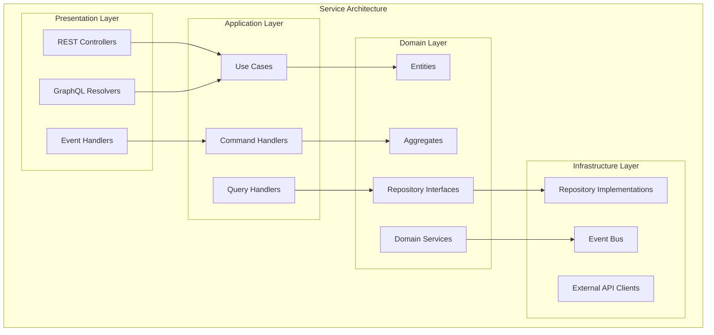
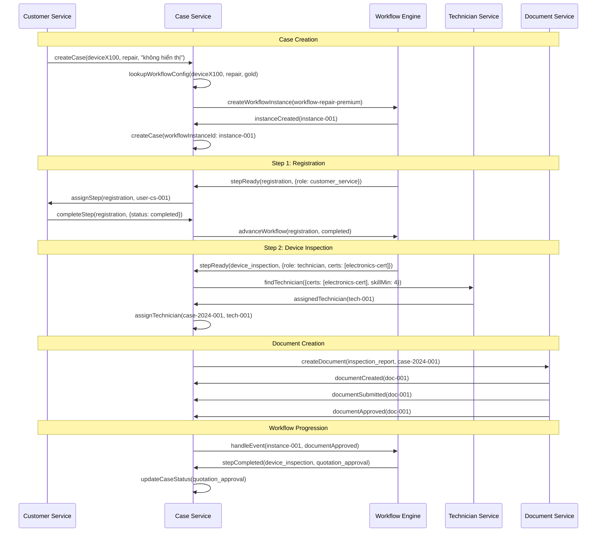
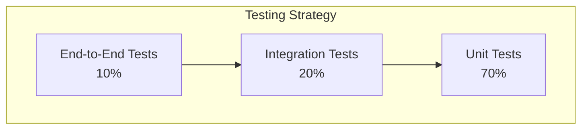
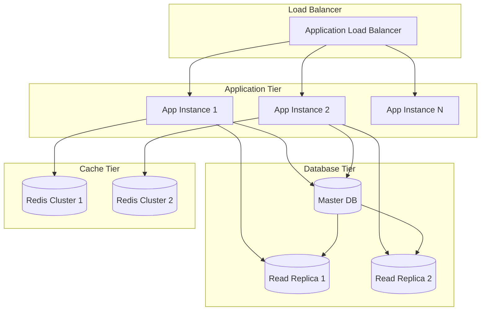

# Design Document - Hệ thống Quản lý Quy trình Sửa chữa Thiết bị

## Overview

Hệ thống quản lý quy trình sửa chữa thiết bị được thiết kế theo kiến trúc microservices với workflow engine làm core, tích hợp các module master data và business logic. Hệ thống sử dụng event-driven architecture để đảm bảo tính nhất quán và khả năng mở rộng.

### Key Design Principles

- **Workflow-Centric**: Tất cả business processes được mô hình hóa thành workflows có thể cấu hình
- **Event-Driven**: Sử dụng events để đồng bộ giữa các services và trigger business logic
- **Domain-Driven Design**: Tổ chức code theo business domains rõ ràng
- **API-First**: Thiết kế APIs trước, đảm bảo integration và testing
- **Audit-First**: Mọi thay đổi đều được ghi lại để compliance và traceability

## Architecture

### High-Level Architecture

```mermaid
graph TB
    subgraph "Client Layer"
        WEB[Web Application]
        MOBILE[Mobile App]
        API_CLIENT[External APIs]
    end
    
    subgraph "API Gateway Layer"
        GATEWAY[API Gateway<br/>Authentication, Rate Limiting, Routing]
    end
    
    subgraph "Application Services"
        WORKFLOW[Workflow Service<br/>Core Engine]
        CASE[Case Service]
        DOCUMENT[Document Service]
        CUSTOMER[Customer Service]
        DEVICE[Device Service]
        TECHNICIAN[Technician Service]
        INVENTORY[Inventory Service]
        CONTRACT[Contract Service]
        TOOLS[Service Tools Service]
        NOTIFICATION[Notification Service]
    end
    
    subgraph "Shared Services"
        AUTH[Authentication Service]
        FILE[File Storage Service]
        SEARCH[Search Service]
        ANALYTICS[Analytics Service]
    end
    
    subgraph "Data Layer"
        POSTGRES[(PostgreSQL<br/>Transactional Data)]
        REDIS[(Redis<br/>Cache & Sessions)]
        ELASTICSEARCH[(Elasticsearch<br/>Search & Analytics)]
        S3[(Object Storage<br/>Files & Documents)]
    end
    
    subgraph "External Systems"
        ERP[ERP System]
        EMAIL[Email Service]
        SMS[SMS Gateway]
        PAYMENT[Payment Gateway]
    end
    
    WEB --> GATEWAY
    MOBILE --> GATEWAY
    API_CLIENT --> GATEWAY
    
    GATEWAY --> WORKFLOW
    GATEWAY --> CASE
    GATEWAY --> DOCUMENT
    GATEWAY --> CUSTOMER
    GATEWAY --> DEVICE
    GATEWAY --> TECHNICIAN
    GATEWAY --> INVENTORY
    GATEWAY --> CONTRACT
    GATEWAY --> TOOLS
    
    WORKFLOW --> POSTGRES
    CASE --> POSTGRES
    DOCUMENT --> POSTGRES
    CUSTOMER --> POSTGRES
    DEVICE --> POSTGRES
    TECHNICIAN --> POSTGRES
    INVENTORY --> POSTGRES
    CONTRACT --> POSTGRES
    TOOLS --> POSTGRES
    
    WORKFLOW --> REDIS
    CASE --> REDIS
    
    DOCUMENT --> S3
    FILE --> S3
    
    SEARCH --> ELASTICSEARCH
    ANALYTICS --> ELASTICSEARCH
    
    NOTIFICATION --> EMAIL
    NOTIFICATION --> SMS
    
    CONTRACT --> ERP
    CUSTOMER --> ERP
```



### Service Architecture Pattern

Mỗi service được thiết kế theo Clean Architecture pattern:



## Components and Interfaces

### 1. Workflow Engine

**Core Responsibilities:**
- Workflow definition management và versioning
- Workflow execution và state management
- Task assignment và routing
- Event handling và triggers

**Key Interfaces:**

```typescript
interface WorkflowEngine {
  // Workflow Definition Management
  createWorkflowDefinition(definition: WorkflowDefinition): Promise<string>
  updateWorkflowDefinition(id: string, definition: WorkflowDefinition): Promise<void>
  getWorkflowDefinition(id: string, version?: string): Promise<WorkflowDefinition>
  
  // Workflow Execution
  startWorkflow(definitionId: string, input: WorkflowInput): Promise<WorkflowInstance>
  advanceWorkflow(instanceId: string, stepId: string, result: StepResult): Promise<void>
  getWorkflowInstance(instanceId: string): Promise<WorkflowInstance>
  
  // Event Handling
  handleEvent(instanceId: string, event: WorkflowEvent): Promise<void>
  subscribeToEvents(callback: EventCallback): void
}

interface WorkflowDefinition {
  id: string
  name: string
  version: string
  steps: WorkflowStep[]
  transitions: WorkflowTransition[]
  variables: WorkflowVariable[]
}

interface WorkflowStep {
  id: string
  name: string
  type: 'manual' | 'automatic' | 'approval' | 'system'
  assignmentRules: AssignmentRule[]
  requiredDocuments: string[]
  timeoutMinutes?: number
  escalationRules: EscalationRule[]
}
```

### 2. Case Management Service

**Core Responsibilities:**
- Case lifecycle management
- Status tracking và history
- Assignment logic
- SLA monitoring
- Workflow orchestration integration

**Relationship with Workflow Engine:**
The Case Management Service acts as the primary orchestrator that bridges business domain logic with the generic Workflow Engine. Here's how they interact:

1. **Case Creation → Workflow Instantiation**:
   - When a case is created, Case Service determines the appropriate workflow definition based on device type, service type, and customer contract
   - Case Service calls Workflow Engine to create a new workflow instance
   - The workflow instance ID is stored in the repair case for tracking

2. **Workflow Step Execution → Case Updates**:
   - Workflow Engine executes steps and notifies Case Service of step completions
   - Case Service updates case status, assigns technicians, and triggers business logic
   - Case Service validates business rules before allowing workflow progression

3. **Business Events → Workflow Events**:
   - Case Service translates business events (document approved, parts received) into workflow events
   - Workflow Engine processes these events and determines next steps
   - Case Service receives workflow state changes and updates case accordingly

## Concrete Example: Máy đo X100 Repair Case

### Scenario Setup
- **Device**: Máy đo X100 (device_type_id: "measurement-device-x100")
- **Customer**: Công ty ABC (tier: "gold")
- **Service Type**: "repair"
- **Issue**: Device không hiển thị kết quả đo

### Step 1: Workflow Configuration Lookup

```sql
-- Workflow Configuration trong database
INSERT INTO workflow_configurations VALUES (
  'config-001',
  'measurement-device-x100',  -- device_type_id
  'repair',                   -- service_type
  'gold',                     -- customer_tier
  'workflow-repair-premium',  -- workflow_definition_id
  'sla-gold-repair',         -- sla_id
  'high',                    -- priority
  8.0,                       -- estimated_duration_hours
  '["calibration-cert", "electronics-cert"]', -- required_certifications
  '["multimeter", "calibration-kit"]',        -- required_tools
  '{"skill_level_min": 4, "experience_years_min": 3}' -- auto_assignment_rules
);
```

### Step 2: Case Creation Flow

```typescript
// 1. Customer Service tạo case
const createCaseRequest = {
  customerId: "customer-abc-001",
  deviceId: "device-x100-serial-123",
  serviceType: "repair",
  description: "Device không hiển thị kết quả đo",
  requestedBy: "user-cs-001",
  urgency: "normal"
}

// 2. Case Service determine workflow configuration
const config = await caseService.determineWorkflowConfiguration(
  "measurement-device-x100", // device type
  "repair",                  // service type
  "customer-abc-001"         // customer (để get tier)
)

// 3. Case Service tạo workflow instance
const workflowInstance = await workflowEngine.createWorkflowInstance(
  config.workflowDefinitionId, // "workflow-repair-premium"
  {
    caseId: newCaseId,
    deviceType: "measurement-device-x100",
    customerTier: "gold",
    priority: "high",
    estimatedHours: 8.0
  }
)

// 4. Case được tạo với workflow instance
const repairCase = {
  id: "case-2024-001",
  caseNumber: "RC-2024-001",
  customerId: "customer-abc-001",
  deviceId: "device-x100-serial-123",
  serviceType: "repair",
  workflowConfigurationId: config.id,
  workflowInstanceId: workflowInstance.id,
  currentStepId: "registration", // first step
  status: "created",
  priority: "high"
}
```

### Step 3: Workflow Definition Example

```json
{
  "id": "workflow-repair-premium",
  "name": "Premium Repair Workflow",
  "version": "1.0",
  "steps": [
    {
      "id": "registration",
      "name": "Đăng ký tiếp nhận",
      "type": "manual",
      "assignmentRules": {
        "role": "customer_service"
      },
      "requiredDocuments": [],
      "transitions": [
        {
          "to": "device_inspection",
          "condition": "status == 'completed'"
        }
      ]
    },
    {
      "id": "device_inspection",
      "name": "Kiểm tra thiết bị",
      "type": "manual",
      "assignmentRules": {
        "role": "technician",
        "requiredCertifications": ["electronics-cert"],
        "skillLevelMin": 4
      },
      "requiredDocuments": ["inspection_report"],
      "requiredTools": ["multimeter"],
      "timeoutHours": 4,
      "transitions": [
        {
          "to": "quotation_approval",
          "condition": "inspection_report.status == 'approved' && inspection_report.severity != 'critical'"
        },
        {
          "to": "manager_review",
          "condition": "inspection_report.severity == 'critical'"
        }
      ]
    },
    {
      "id": "quotation_approval",
      "name": "Phê duyệt báo giá",
      "type": "approval",
      "assignmentRules": {
        "role": "manager"
      },
      "requiredDocuments": ["quotation"],
      "transitions": [
        {
          "to": "repair_execution",
          "condition": "quotation.status == 'approved' && quotation.customer_approved == true"
        }
      ]
    },
    {
      "id": "repair_execution",
      "name": "Thực hiện sửa chữa",
      "type": "manual",
      "assignmentRules": {
        "role": "technician",
        "requiredCertifications": ["calibration-cert", "electronics-cert"],
        "skillLevelMin": 4
      },
      "requiredDocuments": ["repair_report"],
      "requiredTools": ["multimeter", "calibration-kit"],
      "timeoutHours": 6,
      "transitions": [
        {
          "to": "quality_check",
          "condition": "repair_report.status == 'approved'"
        }
      ]
    },
    {
      "id": "quality_check",
      "name": "Kiểm tra chất lượng",
      "type": "manual",
      "assignmentRules": {
        "role": "quality_inspector"
      },
      "requiredDocuments": ["quality_report"],
      "transitions": [
        {
          "to": "delivery",
          "condition": "quality_report.result == 'pass'"
        },
        {
          "to": "repair_execution",
          "condition": "quality_report.result == 'fail'"
        }
      ]
    },
    {
      "id": "delivery",
      "name": "Giao hàng",
      "type": "manual",
      "assignmentRules": {
        "role": "delivery_staff"
      },
      "transitions": [
        {
          "to": "completed",
          "condition": "delivery.status == 'completed'"
        }
      ]
    }
  ]
}
```

### Step 4: Execution Flow Example



### Step 5: Real Data Flow

```typescript
// Khi technician hoàn thành inspection
const inspectionReport = {
  documentId: "doc-001",
  caseId: "case-2024-001",
  findings: [
    {
      component: "Display Module",
      issue: "LCD screen không hoạt động",
      severity: "high"
    },
    {
      component: "Main Board",
      issue: "Capacitor C15 bị phồng",
      severity: "medium"
    }
  ],
  recommendedParts: [
    {
      partName: "LCD Display Module",
      partNumber: "LCD-X100-001",
      quantity: 1,
      reason: "Thay thế màn hình hỏng",
      estimatedCost: 2500000,
      urgency: "immediate"
    },
    {
      partName: "Capacitor 470uF/25V",
      partNumber: "CAP-470-25",
      quantity: 1,
      reason: "Thay thế capacitor bị phồng",
      estimatedCost: 50000,
      urgency: "immediate"
    }
  ],
  estimatedHours: 4,
  severityLevel: "high"
}

// Case Service xử lý document approval
await caseService.handleDocumentApproved("doc-001", "case-2024-001")

// Workflow Engine chuyển sang bước tiếp theo
const nextStep = await workflowEngine.getNextStep("instance-001", "device_inspection")
// nextStep = "quotation_approval" vì severity != "critical"

// Case Service update case status
await caseService.updateCaseStatus("case-2024-001", "quotation_approval")

// Tự động tạo quotation dựa trên inspection report
const quotation = await documentService.createQuotation({
  caseId: "case-2024-001",
  lineItems: [
    {
      type: "part",
      description: "LCD Display Module",
      quantity: 1,
      unitPrice: 2500000,
      totalPrice: 2500000
    },
    {
      type: "part", 
      description: "Capacitor 470uF/25V",
      quantity: 1,
      unitPrice: 50000,
      totalPrice: 50000
    },
    {
      type: "labor",
      description: "Thời gian sửa chữa (4 giờ)",
      quantity: 4,
      unitPrice: 200000,
      totalPrice: 800000
    }
  ],
  totalAmount: 3350000,
  validityPeriod: 30
})
```

### Key Points từ ví dụ:

1. **Configuration-Driven**: Device type + service type + customer tier → specific workflow
2. **Business Logic in Case Service**: Case Service handle assignment, document processing, SLA
3. **Generic Workflow Engine**: Chỉ manage state transitions, không biết business context
4. **Event-Driven**: Documents, assignments, completions trigger workflow events
5. **Flexible**: Có thể có different workflows cho different scenarios (standard vs premium)

Ví dụ này cho thấy Case Service là "conductor" orchestrate toàn bộ process, còn Workflow Engine là "engine" execute the steps.

**Key Interfaces:**

```typescript
interface CaseService {
  createCase(request: CreateCaseRequest): Promise<RepairCase>
  updateCase(id: string, updates: CaseUpdates): Promise<RepairCase>
  getCase(id: string): Promise<RepairCase>
  searchCases(criteria: SearchCriteria): Promise<CaseSearchResult>
  
  // Workflow Integration
  determineWorkflowDefinition(deviceTypeId: string, serviceType: string, customerId: string): Promise<string>
  handleWorkflowStepReady(instanceId: string, stepId: string, stepConfig: WorkflowStepConfig): Promise<void>
  handleWorkflowStepCompleted(instanceId: string, stepId: string, result: StepResult): Promise<void>
  handleWorkflowEvent(instanceId: string, event: WorkflowEvent): Promise<void>
  
  // Assignment
  assignTechnician(caseId: string, technicianId: string): Promise<void>
  reassignCase(caseId: string, newTechnicianId: string, reason: string): Promise<void>
  
  // Status Management
  advanceCase(caseId: string, stepResult: StepResult): Promise<void>
  getCaseHistory(caseId: string): Promise<CaseHistoryEntry[]>
  
  // SLA Monitoring
  checkSLACompliance(caseId: string): Promise<SLAStatus>
  getAtRiskCases(): Promise<RepairCase[]>
}

// Workflow Configuration per Device Type and Service Type
interface WorkflowConfiguration {
  id: string
  deviceTypeId: string
  serviceType: 'repair' | 'maintenance' | 'installation' | 'inspection'
  customerTier?: 'platinum' | 'gold' | 'silver' | 'bronze'
  workflowDefinitionId: string
  slaId: string
  priority: Priority
  estimatedDurationHours: number
  requiredCertifications: string[]
  requiredTools: string[]
  autoAssignmentRules: AssignmentRule[]
}

interface CreateCaseRequest {
  customerId: string
  deviceId: string
  serviceType: string
  priority?: Priority
  description: string
  requestedBy: string
  scheduledDate?: Date
  onsite?: boolean
  urgency?: 'normal' | 'urgent' | 'emergency'
}

interface RepairCase {
  id: string
  caseNumber: string
  customerId: string
  deviceId: string
  workflowInstanceId: string
  currentStepId: string
  status: CaseStatus
  priority: Priority
  assignedTechnicianId?: string
  slaId?: string
  createdAt: Date
  updatedAt: Date
  estimatedCompletionDate?: Date
}
```

### 3. Document Management Service

**Core Responsibilities:**
- Document creation và versioning
- Approval workflow management
- Template management
- File storage integration

**Key Interfaces:**

```typescript
interface DocumentService {
  createDocument(request: CreateDocumentRequest): Promise<Document>
  updateDocument(id: string, content: DocumentContent): Promise<Document>
  submitForApproval(id: string): Promise<void>
  approveDocument(id: string, approverId: string, comments?: string): Promise<void>
  rejectDocument(id: string, approverId: string, reason: string): Promise<void>
  
  // Templates
  getDocumentTemplate(type: DocumentType, deviceType: string): Promise<DocumentTemplate>
  renderDocument(documentId: string): Promise<RenderedDocument>
  
  // Maintenance Checklist Management
  createMaintenanceChecklistTemplate(template: MaintenanceChecklistTemplate): Promise<string>
  getMaintenanceChecklistTemplate(deviceTypeId: string, maintenanceType: string): Promise<MaintenanceChecklistTemplate>
  updateChecklistItem(reportId: string, itemId: string, updates: ChecklistItemUpdate): Promise<void>
  generateMaintenanceSchedule(deviceId: string): Promise<MaintenanceSchedule>
  
  // File Management
  uploadAttachment(documentId: string, file: FileUpload): Promise<Attachment>
  getAttachments(documentId: string): Promise<Attachment[]>
}

interface Document {
  id: string
  caseId: string
  documentTypeId: string
  stepExecutionId?: string
  status: DocumentStatus
  content: DocumentContent
  version: number
  createdBy: string
  createdAt: Date
  updatedAt: Date
  approvals: DocumentApproval[]
  attachments: Attachment[]
}

interface DocumentType {
  id: string
  name: string
  category: 'inspection_report' | 'repair_report' | 'quotation' | 'custom'
  templateConfig: DocumentTemplate
  requiredFields: string[]
  approvalWorkflowId?: string
  isActive: boolean
}

interface InspectionReport {
  id: string
  documentId: string
  findings: InspectionFinding[]
  recommendedParts: RecommendedPart[]
  estimatedHours: number
  severityLevel: 'low' | 'medium' | 'high' | 'critical'
  images: DocumentImage[]
}

interface RecommendedPart {
  partName: string
  partNumber?: string
  quantity: number
  reason: string
  estimatedCost?: number
  urgency: 'immediate' | 'scheduled' | 'optional'
}

interface Quotation {
  id: string
  documentId: string
  lineItems: QuotationLineItem[]
  totalAmount: number
  currency: string
  validityPeriod: number
  termsConditions: string
  customerApprovedAt?: Date
  customerSignatureUrl?: string
}

interface QuotationLineItem {
  type: 'part' | 'labor' | 'travel' | 'other'
  description: string
  quantity: number
  unitPrice: number
  totalPrice: number
  partId?: string
  notes?: string
}

interface RepairReport {
  id: string
  documentId: string
  partsReplaced: ReplacedPart[]
  proceduresPerformed: PerformedProcedure[]
  actualHours: number
  testResults: TestResult[]
  technicianNotes: string
  beforeImages: DocumentImage[]
  afterImages: DocumentImage[]
  customerSatisfactionRating?: number
}

interface ReplacedPart {
  partId: string
  partName: string
  quantity: number
  serialNumbers: string[]
  oldPartCondition: string
  replacementReason: string
  warrantyMonths: number
}

interface PerformedProcedure {
  procedureType: 'calibration' | 'adjustment' | 'cleaning' | 'testing' | 'repair' | 'replacement'
  description: string
  duration: number
  result: 'successful' | 'partial' | 'failed'
  notes?: string
}

interface MaintenanceReport {
  id: string
  documentId: string
  maintenanceType: 'preventive' | 'corrective' | 'emergency'
  checklistTemplateId: string
  checklistItems: MaintenanceChecklistItem[]
  overallCondition: 'excellent' | 'good' | 'fair' | 'poor' | 'critical'
  recommendations: MaintenanceRecommendation[]
  nextMaintenanceDate?: Date
  maintenanceFrequencyMonths?: number
  actualHours: number
  materialsUsed: MaterialUsed[]
  technicianNotes: string
  customerFeedback?: string
}

interface MaintenanceChecklistItem {
  itemId: string
  category: string
  description: string
  type: 'visual' | 'measurement' | 'test' | 'adjustment' | 'replacement'
  required: boolean
  status: 'pass' | 'fail' | 'na' | 'pending'
  actualValue?: string
  expectedValue?: string
  notes?: string
  images?: DocumentImage[]
  completedAt?: Date
  completedBy?: string
}

interface MaintenanceChecklistTemplate {
  id: string
  name: string
  deviceTypeId: string
  maintenanceType: 'preventive' | 'corrective' | 'emergency'
  version: string
  isActive: boolean
  checklistItems: ChecklistTemplateItem[]
  estimatedDurationHours: number
  requiredTools: string[]
  requiredParts: string[]
  safetyRequirements: string[]
  createdBy: string
  createdAt: Date
  updatedAt: Date
}

interface ChecklistTemplateItem {
  id: string
  category: string
  description: string
  type: 'visual' | 'measurement' | 'test' | 'adjustment' | 'replacement'
  required: boolean
  order: number
  expectedValue?: string
  tolerance?: string
  instructions?: string
  safetyNotes?: string
}

interface MaintenanceRecommendation {
  priority: 'immediate' | 'high' | 'medium' | 'low'
  category: 'safety' | 'performance' | 'efficiency' | 'compliance'
  description: string
  estimatedCost?: number
  estimatedHours?: number
  dueDate?: Date
  partIds?: string[]
}
```

### 4. Service Tools Management Service

**Core Responsibilities:**
- Tool inventory và availability tracking
- Tool assignment và checkout/checkin
- Calibration scheduling và maintenance
- Tool requirement validation

**Key Interfaces:**

```typescript
interface ServiceToolsService {
  // Tool Management
  createTool(request: CreateToolRequest): Promise<ServiceTool>
  updateTool(id: string, updates: ToolUpdates): Promise<ServiceTool>
  getTool(id: string): Promise<ServiceTool>
  searchTools(criteria: ToolSearchCriteria): Promise<ToolSearchResult>
  
  // Tool Assignment
  checkoutTool(toolId: string, technicianId: string, caseId?: string): Promise<ToolAssignment>
  checkinTool(assignmentId: string, condition: ToolCondition): Promise<void>
  getToolAssignments(toolId: string): Promise<ToolAssignment[]>
  
  // Availability & Requirements
  checkToolAvailability(toolIds: string[], timeSlot: TimeSlot): Promise<ToolAvailability[]>
  getRequiredTools(deviceTypeId: string, serviceType: string): Promise<ServiceTool[]>
  findAlternativeTools(toolId: string): Promise<ServiceTool[]>
  
  // Maintenance & Calibration
  scheduleCalibration(toolId: string, scheduledDate: Date): Promise<ToolMaintenance>
  recordMaintenance(request: MaintenanceRequest): Promise<ToolMaintenance>
  getMaintenanceSchedule(dateRange: DateRange): Promise<ToolMaintenance[]>
  getToolsNeedingCalibration(): Promise<ServiceTool[]>
}

interface ServiceTool {
  id: string
  toolCode: string
  toolName: string
  category: ToolCategory
  manufacturer: string
  model: string
  serialNumber: string
  purchaseInfo: PurchaseInfo
  status: ToolStatus
  location: string
  calibrationRequired: boolean
  lastCalibrationDate?: Date
  nextCalibrationDate?: Date
  requiredForDeviceTypes: string[]
  specifications: Record<string, any>
  maintenanceHistory: ToolMaintenance[]
}

interface ToolAssignment {
  id: string
  toolId: string
  assignedToTechnicianId: string
  assignedToCaseId?: string
  checkoutDate: Date
  expectedReturnDate: Date
  actualReturnDate?: Date
  conditionCheckout: ToolCondition
  conditionReturn?: ToolCondition
  notes?: string
  status: AssignmentStatus
}

enum ToolCategory {
  MEASUREMENT = 'measurement',
  CALIBRATION = 'calibration',
  DIAGNOSTIC = 'diagnostic',
  REPAIR = 'repair',
  SAFETY = 'safety'
}

enum ToolStatus {
  AVAILABLE = 'available',
  IN_USE = 'in_use',
  MAINTENANCE = 'maintenance',
  CALIBRATION = 'calibration',
  RETIRED = 'retired',
  LOST = 'lost'
}
```

### 5. Smart Assignment Engine

**Core Responsibilities:**
- Technician skill matching
- Workload balancing
- Location optimization
- Availability checking

**Algorithm Design:**

```typescript
interface AssignmentEngine {
  findBestTechnician(request: AssignmentRequest): Promise<TechnicianAssignment>
  calculateAssignmentScore(technician: Technician, case: RepairCase): Promise<number>
  checkAvailability(technicianId: string, timeSlot: TimeSlot): Promise<boolean>
  optimizeSchedule(assignments: Assignment[]): Promise<OptimizedSchedule>
}

class SmartAssignmentEngine implements AssignmentEngine {
  async findBestTechnician(request: AssignmentRequest): Promise<TechnicianAssignment> {
    // 1. Filter by required skills and certifications
    const qualifiedTechnicians = await this.filterBySkills(request.requiredSkills)
    
    // 2. Filter by availability
    let availableTechnicians = await this.filterByAvailability(
      qualifiedTechnicians, 
      request.timeWindow
    )
    
    // 3. Filter by required certificates
    if (request.deviceType.required_certifications.length > 0) {
      availableTechnicians = availableTechnicians.filter(t =>
        this.hasCertificates(t, request.deviceType.required_certifications)
      );
    }
    
    // 4. Check tool availability
    const requiredTools = await this.serviceToolsService.getRequiredTools(
      request.deviceType.id, 
      request.serviceType
    )
    
    if (requiredTools.length > 0) {
      const techniciansWithTools = await this.filterByToolAvailability(
        availableTechnicians,
        requiredTools,
        request.timeWindow
      )
      availableTechnicians = techniciansWithTools
    }
    
    // 5. Calculate scores for each technician
    const scoredTechnicians = await Promise.all(
      availableTechnicians.map(async tech => ({
        technician: tech,
        score: await this.calculateAssignmentScore(tech, request.case)
      }))
    )
    
    // 6. Sort by score and return best match
    scoredTechnicians.sort((a, b) => b.score - a.score)
    
    return {
      technician: scoredTechnicians[0].technician,
      confidence: scoredTechnicians[0].score,
      alternatives: scoredTechnicians.slice(1, 3),
      requiredTools: requiredTools
    }
  }
  
  async filterByToolAvailability(
    technicians: Technician[], 
    requiredTools: ServiceTool[], 
    timeWindow: TimeSlot
  ): Promise<Technician[]> {
    const availableTechnicians = []
    
    for (const technician of technicians) {
      const toolAvailability = await this.serviceToolsService.checkToolAvailability(
        requiredTools.map(t => t.id),
        timeWindow
      )
      
      const allToolsAvailable = toolAvailability.every(ta => ta.available)
      
      if (allToolsAvailable) {
        availableTechnicians.push(technician)
      }
    }
    
    return availableTechnicians
  }
  
  async calculateAssignmentScore(technician: Technician, case: RepairCase): Promise<number> {
    let score = 0
    
    // Skill match (0-40 points)
    const skillMatch = await this.calculateSkillMatch(technician, case.deviceType)
    score += skillMatch * 40
    
    // Workload factor (0-25 points)
    const workloadFactor = 1 - (technician.activeCases / technician.maxConcurrentCases)
    score += workloadFactor * 25
    
    // Location proximity (0-20 points)
    const distance = await this.calculateDistance(technician.location, case.location)
    const proximityScore = Math.max(0, 1 - distance / 100) // 100km max
    score += proximityScore * 20
    
    // Performance history (0-15 points)
    const performanceScore = technician.averageRating / 5
    score += performanceScore * 15
    
    return score
  }
}
```

## Data Models

### Core Entities

```sql
-- Workflow Engine Tables
CREATE TABLE workflow_definitions (
    id UUID PRIMARY KEY,
    name VARCHAR(255) NOT NULL,
    version VARCHAR(50) NOT NULL,
    is_active BOOLEAN DEFAULT true,
    config JSONB NOT NULL,
    created_at TIMESTAMP DEFAULT NOW(),
    updated_at TIMESTAMP DEFAULT NOW(),
    UNIQUE(name, version)
);

CREATE TABLE workflow_instances (
    id UUID PRIMARY KEY,
    definition_id UUID REFERENCES workflow_definitions(id),
    case_id UUID NOT NULL,
    current_step_id VARCHAR(100),
    status VARCHAR(50) NOT NULL,
    variables JSONB DEFAULT '{}',
    started_at TIMESTAMP DEFAULT NOW(),
    completed_at TIMESTAMP,
    INDEX(case_id),
    INDEX(status)
);

-- Workflow Configuration Tables
CREATE TABLE workflow_configurations (
    id UUID PRIMARY KEY,
    device_type_id UUID NOT NULL,
    service_type VARCHAR(50) NOT NULL,
    customer_tier VARCHAR(20),
    workflow_definition_id UUID REFERENCES workflow_definitions(id),
    sla_id UUID,
    priority VARCHAR(20) DEFAULT 'medium',
    estimated_duration_hours DECIMAL(5,2),
    required_certifications JSONB DEFAULT '[]',
    required_tools JSONB DEFAULT '[]',
    auto_assignment_rules JSONB DEFAULT '{}',
    is_active BOOLEAN DEFAULT true,
    created_at TIMESTAMP DEFAULT NOW(),
    updated_at TIMESTAMP DEFAULT NOW(),
    INDEX(device_type_id),
    INDEX(service_type),
    INDEX(customer_tier),
    INDEX(is_active),
    UNIQUE(device_type_id, service_type, customer_tier)
);

-- Case Management Tables
CREATE TABLE repair_cases (
    id UUID PRIMARY KEY,
    case_number VARCHAR(50) UNIQUE NOT NULL,
    customer_id UUID NOT NULL,
    device_id UUID NOT NULL,
    service_type VARCHAR(50) NOT NULL,
    workflow_configuration_id UUID REFERENCES workflow_configurations(id),
    workflow_instance_id UUID REFERENCES workflow_instances(id),
    current_step_id VARCHAR(100),
    status VARCHAR(50) NOT NULL,
    priority VARCHAR(20) DEFAULT 'medium',
    assigned_technician_id UUID,
    sla_id UUID,
    description TEXT,
    requested_by UUID NOT NULL,
    scheduled_date TIMESTAMP,
    onsite BOOLEAN DEFAULT false,
    urgency VARCHAR(20) DEFAULT 'normal',
    estimated_completion_date TIMESTAMP,
    actual_completion_date TIMESTAMP,
    created_at TIMESTAMP DEFAULT NOW(),
    updated_at TIMESTAMP DEFAULT NOW(),
    INDEX(customer_id),
    INDEX(device_id),
    INDEX(service_type),
    INDEX(workflow_configuration_id),
    INDEX(workflow_instance_id),
    INDEX(assigned_technician_id),
    INDEX(status),
    INDEX(created_at)
);

-- Document Management Tables
CREATE TABLE document_types (
    id UUID PRIMARY KEY,
    name VARCHAR(100) NOT NULL,
    category VARCHAR(50) NOT NULL, -- inspection_report/repair_report/quotation
    template_config JSONB NOT NULL,
    required_fields JSONB NOT NULL,
    approval_workflow_id UUID,
    is_active BOOLEAN DEFAULT true,
    created_at TIMESTAMP DEFAULT NOW(),
    updated_at TIMESTAMP DEFAULT NOW(),
    INDEX(name),
    INDEX(category)
);

CREATE TABLE documents (
    id UUID PRIMARY KEY,
    case_id UUID REFERENCES repair_cases(id),
    document_type_id UUID REFERENCES document_types(id),
    step_execution_id UUID, -- Liên kết với bước workflow
    status VARCHAR(50) DEFAULT 'draft',
    content JSONB NOT NULL, -- Nội dung động
    version INTEGER DEFAULT 1,
    created_by UUID NOT NULL,
    created_at TIMESTAMP DEFAULT NOW(),
    updated_at TIMESTAMP DEFAULT NOW(),
    INDEX(case_id),
    INDEX(document_type_id),
    INDEX(status),
    INDEX(step_execution_id)
);

CREATE TABLE document_approvals (
    id UUID PRIMARY KEY,
    document_id UUID REFERENCES documents(id),
    approver_user_id UUID NOT NULL,
    approval_level INTEGER NOT NULL,
    status VARCHAR(50) DEFAULT 'pending',
    comments TEXT,
    approved_at TIMESTAMP,
    INDEX(document_id),
    INDEX(approver_user_id),
    INDEX(status)
);

-- Specific Document Types
CREATE TABLE inspection_reports (
    id UUID PRIMARY KEY,
    document_id UUID REFERENCES documents(id),
    findings JSONB NOT NULL,
    recommended_parts JSONB DEFAULT '[]', -- [{part_name, quantity, reason}]
    estimated_hours DECIMAL(5,2),
    severity_level VARCHAR(20),
    images JSONB DEFAULT '[]',
    INDEX(document_id),
    INDEX(severity_level)
);

CREATE TABLE quotations (
    id UUID PRIMARY KEY,
    document_id UUID REFERENCES documents(id),
    line_items JSONB NOT NULL, -- Parts, labor, etc.
    total_amount DECIMAL(15,2) NOT NULL,
    currency VARCHAR(3) DEFAULT 'VND',
    validity_period INTEGER DEFAULT 30, -- days
    terms_conditions TEXT,
    customer_approved_at TIMESTAMP,
    customer_signature_url VARCHAR(500),
    INDEX(document_id),
    INDEX(total_amount),
    INDEX(customer_approved_at)
);

CREATE TABLE repair_reports (
    id UUID PRIMARY KEY,
    document_id UUID REFERENCES documents(id),
    parts_replaced JSONB DEFAULT '[]', -- [{part_id, quantity, serial_numbers}]
    procedures_performed JSONB DEFAULT '[]', -- [calibration, adjustment, etc.]
    actual_hours DECIMAL(5,2),
    test_results JSONB DEFAULT '{}',
    technician_notes TEXT,
    before_images JSONB DEFAULT '[]',
    after_images JSONB DEFAULT '[]',
    customer_satisfaction_rating INTEGER, -- 1-5
    INDEX(document_id),
    INDEX(actual_hours)
);

CREATE TABLE maintenance_reports (
    id UUID PRIMARY KEY,
    document_id UUID REFERENCES documents(id),
    maintenance_type VARCHAR(50) NOT NULL, -- preventive/corrective/emergency
    checklist_template_id UUID NOT NULL,
    checklist_items JSONB NOT NULL, -- [{item_id, description, status, notes, images}]
    overall_condition VARCHAR(20), -- excellent/good/fair/poor/critical
    recommendations JSONB DEFAULT '[]', -- [{priority, description, estimated_cost}]
    next_maintenance_date DATE,
    maintenance_frequency_months INTEGER,
    actual_hours DECIMAL(5,2),
    materials_used JSONB DEFAULT '[]',
    technician_notes TEXT,
    customer_feedback TEXT,
    INDEX(document_id),
    INDEX(maintenance_type),
    INDEX(checklist_template_id),
    INDEX(next_maintenance_date)
);

-- Maintenance Checklist Templates
CREATE TABLE maintenance_checklist_templates (
    id UUID PRIMARY KEY,
    name VARCHAR(255) NOT NULL,
    device_type_id UUID NOT NULL,
    maintenance_type VARCHAR(50) NOT NULL,
    version VARCHAR(10) DEFAULT '1.0',
    is_active BOOLEAN DEFAULT true,
    checklist_items JSONB NOT NULL, -- [{id, category, description, type, required, order}]
    estimated_duration_hours DECIMAL(4,2),
    required_tools JSONB DEFAULT '[]',
    required_parts JSONB DEFAULT '[]',
    safety_requirements JSONB DEFAULT '[]',
    created_by UUID NOT NULL,
    created_at TIMESTAMP DEFAULT NOW(),
    updated_at TIMESTAMP DEFAULT NOW(),
    INDEX(device_type_id),
    INDEX(maintenance_type),
    INDEX(is_active)
);

-- Master Data Tables
CREATE TABLE customers (
    id UUID PRIMARY KEY,
    customer_code VARCHAR(50) UNIQUE NOT NULL,
    customer_type VARCHAR(20) NOT NULL,
    company_name VARCHAR(255),
    tax_code VARCHAR(50),
    industry VARCHAR(100),
    contact_info JSONB NOT NULL,
    address_info JSONB NOT NULL,
    credit_limit DECIMAL(15,2),
    payment_terms INTEGER,
    customer_tier VARCHAR(20) DEFAULT 'bronze',
    status VARCHAR(20) DEFAULT 'active',
    created_at TIMESTAMP DEFAULT NOW(),
    updated_at TIMESTAMP DEFAULT NOW(),
    INDEX(customer_code),
    INDEX(customer_type),
    INDEX(status)
);

CREATE TABLE devices (
    id UUID PRIMARY KEY,
    device_code VARCHAR(50) UNIQUE NOT NULL,
    customer_id UUID REFERENCES customers(id),
    device_type_id UUID NOT NULL,
    manufacturer VARCHAR(100),
    model VARCHAR(100),
    serial_number VARCHAR(100),
    specifications JSONB,
    location_info JSONB,
    status VARCHAR(50) DEFAULT 'active',
    warranty_info JSONB,
    last_service_date DATE,
    next_service_date DATE,
    qr_code VARCHAR(255),
    created_at TIMESTAMP DEFAULT NOW(),
    updated_at TIMESTAMP DEFAULT NOW(),
    INDEX(customer_id),
    INDEX(device_type_id),
    INDEX(serial_number),
    INDEX(status)
);

CREATE TABLE technicians (
    id UUID PRIMARY KEY,
    employee_code VARCHAR(50) UNIQUE NOT NULL,
    user_id UUID NOT NULL,
    personal_info JSONB NOT NULL,
    employment_info JSONB NOT NULL,
    skills JSONB NOT NULL,
    certifications JSONB DEFAULT '[]',
    schedule_info JSONB NOT NULL,
    performance_metrics JSONB DEFAULT '{}',
    max_concurrent_cases INTEGER DEFAULT 5,
    status VARCHAR(20) DEFAULT 'active',
    created_at TIMESTAMP DEFAULT NOW(),
    updated_at TIMESTAMP DEFAULT NOW(),
    INDEX(employee_code),
    INDEX(user_id),
    INDEX(status)
);

-- Service Tools Management Tables
CREATE TABLE service_tools (
    id UUID PRIMARY KEY,
    tool_code VARCHAR(50) UNIQUE NOT NULL,
    tool_name VARCHAR(255) NOT NULL,
    category VARCHAR(50) NOT NULL,
    manufacturer VARCHAR(100),
    model VARCHAR(100),
    serial_number VARCHAR(100),
    purchase_date DATE,
    purchase_cost DECIMAL(12,2),
    status VARCHAR(20) DEFAULT 'available',
    location VARCHAR(255),
    calibration_required BOOLEAN DEFAULT false,
    last_calibration_date DATE,
    next_calibration_date DATE,
    required_for_device_types JSONB DEFAULT '[]',
    specifications JSONB DEFAULT '{}',
    created_at TIMESTAMP DEFAULT NOW(),
    updated_at TIMESTAMP DEFAULT NOW(),
    INDEX(tool_code),
    INDEX(category),
    INDEX(status),
    INDEX(next_calibration_date)
);

CREATE TABLE tool_assignments (
    id UUID PRIMARY KEY,
    tool_id UUID REFERENCES service_tools(id),
    assigned_to_technician_id UUID NOT NULL,
    assigned_to_case_id UUID,
    checkout_date TIMESTAMP DEFAULT NOW(),
    expected_return_date TIMESTAMP,
    actual_return_date TIMESTAMP,
    condition_checkout VARCHAR(50) DEFAULT 'good',
    condition_return VARCHAR(50),
    notes TEXT,
    status VARCHAR(20) DEFAULT 'active',
    INDEX(tool_id),
    INDEX(assigned_to_technician_id),
    INDEX(assigned_to_case_id),
    INDEX(checkout_date)
);

CREATE TABLE tool_maintenance (
    id UUID PRIMARY KEY,
    tool_id UUID REFERENCES service_tools(id),
    maintenance_type VARCHAR(50) NOT NULL,
    scheduled_date DATE,
    completed_date DATE,
    performed_by UUID,
    cost DECIMAL(10,2),
    next_maintenance_date DATE,
    status VARCHAR(20) DEFAULT 'scheduled',
    notes TEXT,
    attachments JSONB DEFAULT '[]',
    INDEX(tool_id),
    INDEX(maintenance_type),
    INDEX(scheduled_date),
    INDEX(status)
);

-- Inventory Management Tables
CREATE TABLE spare_parts (
    id UUID PRIMARY KEY,
    part_number VARCHAR(100) UNIQUE NOT NULL,
    part_name VARCHAR(255) NOT NULL,
    category VARCHAR(100),
    manufacturer VARCHAR(100),
    specifications JSONB,
    compatible_devices JSONB DEFAULT '[]',
    pricing_info JSONB NOT NULL,
    inventory_settings JSONB NOT NULL,
    status VARCHAR(20) DEFAULT 'active',
    created_at TIMESTAMP DEFAULT NOW(),
    updated_at TIMESTAMP DEFAULT NOW(),
    INDEX(part_number),
    INDEX(category),
    INDEX(manufacturer)
);

CREATE TABLE inventory_transactions (
    id UUID PRIMARY KEY,
    spare_part_id UUID REFERENCES spare_parts(id),
    warehouse_id UUID NOT NULL,
    transaction_type VARCHAR(20) NOT NULL,
    quantity INTEGER NOT NULL,
    unit_cost DECIMAL(10,2),
    reference_type VARCHAR(50),
    reference_id UUID,
    performed_by UUID NOT NULL,
    transaction_date TIMESTAMP DEFAULT NOW(),
    notes TEXT,
    INDEX(spare_part_id),
    INDEX(warehouse_id),
    INDEX(transaction_type),
    INDEX(transaction_date)
);
```

### Event Schema

```typescript
// Domain Events
interface DomainEvent {
  id: string
  aggregateId: string
  aggregateType: string
  eventType: string
  eventData: any
  version: number
  occurredAt: Date
  causedBy: string
}

// Specific Events
interface CaseCreatedEvent extends DomainEvent {
  eventType: 'CaseCreated'
  eventData: {
    caseId: string
    customerId: string
    deviceId: string
    priority: Priority
    workflowDefinitionId: string
  }
}

interface DocumentApprovedEvent extends DomainEvent {
  eventType: 'DocumentApproved'
  eventData: {
    documentId: string
    caseId: string
    documentType: string
    approverId: string
    approvalLevel: number
  }
}

interface SLABreachedEvent extends DomainEvent {
  eventType: 'SLABreached'
  eventData: {
    caseId: string
    slaId: string
    breachType: 'response' | 'resolution'
    targetTime: number
    actualTime: number
    penaltyAmount?: number
  }
}

interface ToolCheckedOutEvent extends DomainEvent {
  eventType: 'ToolCheckedOut'
  eventData: {
    toolId: string
    technicianId: string
    caseId?: string
    checkoutDate: Date
    expectedReturnDate: Date
  }
}

interface ToolCalibrationDueEvent extends DomainEvent {
  eventType: 'ToolCalibrationDue'
  eventData: {
    toolId: string
    toolName: string
    dueDate: Date
    daysOverdue: number
  }
}
```

## Error Handling

### Error Classification

```typescript
abstract class DomainError extends Error {
  abstract readonly code: string
  abstract readonly statusCode: number
}

class ValidationError extends DomainError {
  readonly code = 'VALIDATION_ERROR'
  readonly statusCode = 400
}

class BusinessRuleViolationError extends DomainError {
  readonly code = 'BUSINESS_RULE_VIOLATION'
  readonly statusCode = 422
}

class ResourceNotFoundError extends DomainError {
  readonly code = 'RESOURCE_NOT_FOUND'
  readonly statusCode = 404
}

class ConcurrencyError extends DomainError {
  readonly code = 'CONCURRENCY_ERROR'
  readonly statusCode = 409
}
```

### Error Handling Strategy

1. **Validation Errors**: Return immediately với detailed field-level errors
2. **Business Rule Violations**: Log và return với business context
3. **Infrastructure Errors**: Retry với exponential backoff, fallback mechanisms
4. **Concurrency Errors**: Implement optimistic locking với retry logic

## Testing Strategy

### Testing Pyramid



### Test Categories

1. **Unit Tests (70%)**
   - Domain logic testing
   - Business rule validation
   - Algorithm testing (assignment engine, SLA calculation)
   - Mock external dependencies

2. **Integration Tests (20%)**
   - Database integration
   - Event publishing/consuming
   - External API integration
   - Workflow engine integration

3. **End-to-End Tests (10%)**
   - Complete user journeys
   - Cross-service workflows
   - SLA compliance scenarios
   - Error recovery scenarios

### Test Data Strategy

```typescript
// Test Data Builders
class CaseTestDataBuilder {
  private case: Partial<RepairCase> = {}
  
  withCustomer(customerId: string): CaseTestDataBuilder {
    this.case.customerId = customerId
    return this
  }
  
  withDevice(deviceId: string): CaseTestDataBuilder {
    this.case.deviceId = deviceId
    return this
  }
  
  withPriority(priority: Priority): CaseTestDataBuilder {
    this.case.priority = priority
    return this
  }
  
  build(): RepairCase {
    return {
      id: this.case.id || generateUUID(),
      caseNumber: this.case.caseNumber || generateCaseNumber(),
      customerId: this.case.customerId || generateUUID(),
      deviceId: this.case.deviceId || generateUUID(),
      status: this.case.status || 'created',
      priority: this.case.priority || 'medium',
      createdAt: this.case.createdAt || new Date(),
      updatedAt: this.case.updatedAt || new Date(),
      ...this.case
    } as RepairCase
  }
}
```

### Performance Testing

- **Load Testing**: Simulate normal traffic patterns
- **Stress Testing**: Test system limits và failure modes
- **Spike Testing**: Handle sudden traffic increases
- **Volume Testing**: Large data set processing
- **Endurance Testing**: Long-running stability

## Security Considerations

### Authentication & Authorization

```typescript
interface SecurityContext {
  userId: string
  roles: string[]
  permissions: string[]
  customerId?: string // For customer users
  technicianId?: string // For technician users
}

// Role-Based Access Control
enum Role {
  ADMIN = 'admin',
  MANAGER = 'manager',
  TECHNICIAN = 'technician',
  CUSTOMER_SERVICE = 'customer_service',
  CUSTOMER = 'customer'
}

// Permission-Based Authorization
enum Permission {
  CASE_CREATE = 'case:create',
  CASE_VIEW = 'case:view',
  CASE_EDIT = 'case:edit',
  CASE_DELETE = 'case:delete',
  DOCUMENT_APPROVE = 'document:approve',
  TECHNICIAN_ASSIGN = 'technician:assign',
  INVENTORY_MANAGE = 'inventory:manage',
  WORKFLOW_DESIGN = 'workflow:design'
}
```

### Data Protection

1. **Encryption at Rest**: Database encryption, file storage encryption
2. **Encryption in Transit**: TLS 1.3 for all communications
3. **PII Protection**: Tokenization of sensitive customer data
4. **Audit Logging**: Comprehensive audit trail for compliance
5. **Data Retention**: Automated data lifecycle management

### API Security

- **Rate Limiting**: Prevent abuse và DoS attacks
- **Input Validation**: Comprehensive validation at API boundaries
- **SQL Injection Prevention**: Parameterized queries, ORM usage
- **CORS Configuration**: Proper cross-origin resource sharing
- **API Versioning**: Backward compatibility và deprecation strategy

## Scalability & Performance

### Horizontal Scaling Strategy



### Caching Strategy

1. **Application Cache**: In-memory caching for frequently accessed data
2. **Database Query Cache**: Redis for expensive query results
3. **Session Cache**: User sessions và authentication tokens
4. **CDN**: Static assets và document previews

### Database Optimization

1. **Indexing Strategy**: Composite indexes for common query patterns
2. **Partitioning**: Time-based partitioning for historical data
3. **Read Replicas**: Separate read traffic from write operations
4. **Connection Pooling**: Efficient database connection management

### Monitoring & Observability

```typescript
// Metrics Collection
interface Metrics {
  // Business Metrics
  casesCreatedPerHour: number
  averageResolutionTime: number
  slaComplianceRate: number
  customerSatisfactionScore: number
  
  // Technical Metrics
  apiResponseTime: number
  databaseQueryTime: number
  errorRate: number
  throughput: number
  
  // Infrastructure Metrics
  cpuUtilization: number
  memoryUsage: number
  diskUsage: number
  networkLatency: number
}

// Alerting Rules
const alertingRules = [
  {
    name: 'High Error Rate',
    condition: 'errorRate > 5%',
    severity: 'critical',
    notification: ['email', 'slack']
  },
  {
    name: 'SLA Breach Risk',
    condition: 'casesAtRisk > 10',
    severity: 'warning',
    notification: ['email']
  },
  {
    name: 'Database Performance',
    condition: 'avgQueryTime > 1000ms',
    severity: 'warning',
    notification: ['slack']
  }
]
```

Thiết kế này cung cấp một foundation vững chắc cho việc phát triển hệ thống quản lý quy trình sửa chữa thiết bị với khả năng mở rộng, bảo mật, và hiệu suất cao.
## War
ranty vs Non-Warranty Workflow Example

### Scenario: Same Device, Different Warranty Status

**Device**: Máy đo X100 (device_type_id: "measurement-device-x100")
**Customer**: Công ty ABC (tier: "gold") 
**Service Type**: "repair"
**Issue**: Device không hiển thị kết quả đo

### Case 1: Device TRONG bảo hành

```sql
-- Workflow Configuration cho device trong bảo hành
INSERT INTO workflow_configurations VALUES (
  'config-warranty-001',
  'measurement-device-x100',     -- device_type_id
  'repair',                      -- service_type
  'gold',                        -- customer_tier
  'workflow-warranty-repair',    -- workflow_definition_id (KHÁC)
  'sla-warranty-repair',         -- sla_id (SLA nhanh hơn)
  'high',                        -- priority
  4.0,                          -- estimated_duration_hours (ít hơn)
  '["basic-cert"]',             -- required_certifications (ít hơn)
  '["basic-tools"]',            -- required_tools
  '{"approval_required": false}' -- auto_assignment_rules (không cần approval)
);
```

**Warranty Repair Workflow:**
```json
{
  "id": "workflow-warranty-repair",
  "name": "Warranty Repair Workflow",
  "steps": [
    {
      "id": "warranty_verification",
      "name": "Xác minh bảo hành",
      "type": "automatic",
      "systemAction": "checkWarrantyStatus",
      "transitions": [
        {
          "to": "fast_inspection",
          "condition": "warranty.status == 'valid'"
        },
        {
          "to": "warranty_expired_flow",
          "condition": "warranty.status == 'expired'"
        }
      ]
    },
    {
      "id": "fast_inspection",
      "name": "Kiểm tra nhanh",
      "type": "manual",
      "assignmentRules": {
        "role": "technician",
        "skillLevelMin": 2  // Thấp hơn vì warranty cover
      },
      "requiredDocuments": ["simple_inspection_report"],
      "timeoutHours": 2,  // Nhanh hơn
      "transitions": [
        {
          "to": "warranty_repair",
          "condition": "inspection.covered_by_warranty == true"
        },
        {
          "to": "customer_approval",
          "condition": "inspection.covered_by_warranty == false"
        }
      ]
    },
    {
      "id": "warranty_repair",
      "name": "Sửa chữa bảo hành",
      "type": "manual",
      "assignmentRules": {
        "role": "technician"
      },
      "requiredDocuments": ["warranty_repair_report"],
      "approvalRequired": false,  // KHÔNG cần approval
      "chargeable": false,        // MIỄN PHÍ
      "transitions": [
        {
          "to": "delivery",
          "condition": "repair.status == 'completed'"
        }
      ]
    },
    {
      "id": "delivery",
      "name": "Giao hàng",
      "type": "manual",
      "chargeable": false,  // Miễn phí delivery
      "transitions": [
        {
          "to": "completed"
        }
      ]
    }
  ]
}
```

### Case 2: Device HẾT bảo hành

```sql
-- Workflow Configuration cho device hết bảo hành  
INSERT INTO workflow_configurations VALUES (
  'config-paid-001',
  'measurement-device-x100',     -- device_type_id (SAME)
  'repair',                      -- service_type (SAME)
  'gold',                        -- customer_tier (SAME)
  'workflow-paid-repair',        -- workflow_definition_id (KHÁC)
  'sla-paid-repair',            -- sla_id (SLA chậm hơn)
  'medium',                      -- priority (thấp hơn)
  8.0,                          -- estimated_duration_hours (nhiều hơn)
  '["advanced-cert"]',          -- required_certifications (nhiều hơn)
  '["full-toolkit"]',           -- required_tools
  '{"approval_required": true, "cost_limit": 5000000}' -- auto_assignment_rules
);
```

**Paid Repair Workflow:**
```json
{
  "id": "workflow-paid-repair", 
  "name": "Paid Repair Workflow",
  "steps": [
    {
      "id": "warranty_check",
      "name": "Kiểm tra bảo hành",
      "type": "automatic",
      "systemAction": "checkWarrantyStatus",
      "transitions": [
        {
          "to": "detailed_inspection",
          "condition": "warranty.status == 'expired'"
        },
        {
          "to": "warranty_flow",
          "condition": "warranty.status == 'valid'"
        }
      ]
    },
    {
      "id": "detailed_inspection",
      "name": "Kiểm tra chi tiết",
      "type": "manual",
      "assignmentRules": {
        "role": "senior_technician",
        "skillLevelMin": 4,  // Cao hơn vì phải estimate cost
        "requiredCertifications": ["advanced-cert"]
      },
      "requiredDocuments": ["detailed_inspection_report"],
      "timeoutHours": 4,  // Lâu hơn
      "transitions": [
        {
          "to": "cost_estimation",
          "condition": "inspection.status == 'approved'"
        }
      ]
    },
    {
      "id": "cost_estimation",
      "name": "Ước tính chi phí",
      "type": "manual",
      "assignmentRules": {
        "role": "estimator"
      },
      "requiredDocuments": ["quotation"],
      "transitions": [
        {
          "to": "manager_approval",
          "condition": "quotation.total_amount > 2000000"  // Cần approval nếu > 2M
        },
        {
          "to": "customer_approval",
          "condition": "quotation.total_amount <= 2000000"
        }
      ]
    },
    {
      "id": "manager_approval",
      "name": "Phê duyệt quản lý",
      "type": "approval",
      "assignmentRules": {
        "role": "manager"
      },
      "requiredDocuments": ["quotation"],
      "transitions": [
        {
          "to": "customer_approval",
          "condition": "manager_approval.status == 'approved'"
        },
        {
          "to": "quotation_revision",
          "condition": "manager_approval.status == 'rejected'"
        }
      ]
    },
    {
      "id": "customer_approval",
      "name": "Phê duyệt khách hàng",
      "type": "external_approval",
      "assignmentRules": {
        "role": "customer_service"
      },
      "timeoutHours": 72,  // 3 ngày chờ customer
      "transitions": [
        {
          "to": "paid_repair",
          "condition": "customer_approval.status == 'approved'"
        },
        {
          "to": "cancelled",
          "condition": "customer_approval.status == 'rejected'"
        }
      ]
    },
    {
      "id": "paid_repair",
      "name": "Sửa chữa có phí",
      "type": "manual",
      "assignmentRules": {
        "role": "senior_technician",
        "requiredCertifications": ["advanced-cert"]
      },
      "requiredDocuments": ["paid_repair_report"],
      "chargeable": true,  // CÓ PHÍ
      "transitions": [
        {
          "to": "quality_inspection",
          "condition": "repair.status == 'completed'"
        }
      ]
    },
    {
      "id": "quality_inspection",
      "name": "Kiểm tra chất lượng",
      "type": "manual",
      "assignmentRules": {
        "role": "quality_inspector"
      },
      "requiredDocuments": ["quality_report"],
      "transitions": [
        {
          "to": "invoice_generation",
          "condition": "quality.result == 'pass'"
        },
        {
          "to": "paid_repair",
          "condition": "quality.result == 'fail'"
        }
      ]
    },
    {
      "id": "invoice_generation",
      "name": "Tạo hóa đơn",
      "type": "automatic",
      "systemAction": "generateInvoice",
      "transitions": [
        {
          "to": "payment_confirmation",
          "condition": "invoice.status == 'generated'"
        }
      ]
    },
    {
      "id": "payment_confirmation",
      "name": "Xác nhận thanh toán",
      "type": "manual",
      "assignmentRules": {
        "role": "accounting"
      },
      "transitions": [
        {
          "to": "paid_delivery",
          "condition": "payment.status == 'confirmed'"
        }
      ]
    },
    {
      "id": "paid_delivery",
      "name": "Giao hàng có phí",
      "type": "manual",
      "chargeable": true,  // Có phí delivery
      "transitions": [
        {
          "to": "completed"
        }
      ]
    }
  ]
}
```

### Configuration Selection Logic

```typescript
class CaseService {
  async determineWorkflowConfiguration(
    deviceId: string, 
    serviceType: string, 
    customerId: string
  ): Promise<WorkflowConfiguration> {
    
    // 1. Get device info
    const device = await this.deviceService.getDevice(deviceId)
    const customer = await this.customerService.getCustomer(customerId)
    
    // 2. Check warranty status
    const warrantyStatus = await this.warrantyService.checkWarranty(deviceId)
    
    // 3. Determine configuration key
    let configKey = `${device.deviceTypeId}-${serviceType}-${customer.tier}`
    
    // 4. Modify based on warranty status
    if (warrantyStatus.isValid) {
      configKey += '-warranty'
    } else {
      configKey += '-paid'
    }
    
    // 5. Get configuration
    const config = await this.getWorkflowConfiguration(configKey)
    
    return config
  }
}
```

### Execution Comparison

**Warranty Case Flow:**
```
Warranty Verification (Auto) 
→ Fast Inspection (2h, basic tech) 
→ Warranty Repair (no approval, free) 
→ Free Delivery 
→ Completed

Total Time: ~6 hours
Cost: FREE
Approvals: 0
```

**Non-Warranty Case Flow:**
```
Warranty Check (Auto) 
→ Detailed Inspection (4h, senior tech) 
→ Cost Estimation 
→ Manager Approval (if >2M)
→ Customer Approval (up to 72h)
→ Paid Repair (senior tech) 
→ Quality Inspection 
→ Invoice Generation (Auto)
→ Payment Confirmation 
→ Paid Delivery 
→ Completed

Total Time: ~80+ hours (including customer approval)
Cost: CHARGED
Approvals: 2-3 levels
```

### Database Records Example

```sql
-- Case 1: Warranty repair
INSERT INTO repair_cases VALUES (
  'case-warranty-001',
  'RC-W-2024-001',
  'customer-abc',
  'device-x100-123',
  'repair',
  'config-warranty-001',    -- warranty configuration
  'workflow-instance-w001',
  'warranty_repair',
  'high',
  'tech-junior-001',        -- junior tech OK
  'sla-warranty-repair',    -- 4h SLA
  false,                    -- not chargeable
  NOW()
);

-- Case 2: Paid repair  
INSERT INTO repair_cases VALUES (
  'case-paid-001',
  'RC-P-2024-001', 
  'customer-abc',
  'device-x100-456',
  'repair',
  'config-paid-001',       -- paid configuration
  'workflow-instance-p001',
  'customer_approval',
  'medium',
  'tech-senior-001',       -- senior tech required
  'sla-paid-repair',       -- 24h SLA
  true,                    -- chargeable
  NOW()
);
```

**Key Differences:**
1. **Workflow Definition**: Completely different workflows
2. **SLA**: Warranty cases have faster SLA
3. **Skill Requirements**: Warranty needs basic, paid needs senior
4. **Approval Levels**: Warranty = 0, Paid = 2-3
5. **Cost**: Warranty = free, Paid = charged
6. **Timeline**: Warranty = hours, Paid = days

Ví dụ này cho thấy cách same device type nhưng different business conditions (warranty status) dẫn đến completely different workflows!