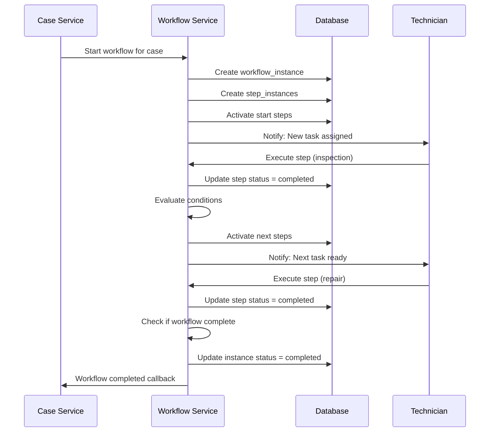

# PHÂN TÍCH MODULE WORKFLOW - DEVICE REPAIR MANAGEMENT SYSTEM

## 1. TỔNG QUAN KIẾN TRÚC WORKFLOW

### 1.1 Vị Trí Trong Hệ Thống
Workflow Service là **orchestration engine** (công cụ điều phối) trung tâm của hệ thống DRMS, chịu trách nhiệm:
- Quản lý toàn bộ quy trình sửa chữa từ đầu đến cuối
- Điều phối luồng công việc giữa các services khác
- Theo dõi trạng thái và tiến độ của mỗi case
- Đảm bảo tuân thủ SLA và quy trình chuẩn

### 1.2 Kiến Trúc Microservice
```
📦 services/workflow-service/
├── 🔧 src/
│   ├── index.ts                     # Entry point - Port 3002
│   ├── config/                      # Configuration
│   ├── services/                    # Business logic services
│   │   ├── workflow-definition.service.ts    # Quản lý định nghĩa workflow
│   │   ├── workflow-template.service.ts      # Templates tái sử dụng
│   │   ├── workflow-execution.service.ts     # Thực thi workflow
│   │   ├── workflow-monitoring.service.ts    # Giám sát real-time
│   │   ├── workflow-debugging.service.ts     # Debug và phân tích lỗi
│   │   ├── workflow-visualization.service.ts # Tạo biểu đồ DAG
│   │   ├── workflow-configuration.service.ts # Cấu hình runtime
│   │   ├── workflow-event.service.ts         # Event logging
│   │   └── workflow-alerting.service.ts      # Cảnh báo SLA
│   ├── routes/                      # REST API endpoints
│   ├── middleware/                  # Auth, validation, logging
│   └── utils/                       # Helpers
│       ├── workflow-validator.ts            # Kiểm tra tính hợp lệ
│       ├── workflow-version-manager.ts      # Quản lý phiên bản
│       ├── workflow-condition-evaluator.ts  # Đánh giá điều kiện
│       └── workflow-action-executor.ts      # Thực thi actions
```

---

## 2. CƠ SỞ DỮ LIỆU WORKFLOW

### 2.1 Schema Tables (Migration 001)

#### **workflow_definitions** - Định nghĩa workflow
```sql
CREATE TABLE workflow_definitions (
  id UUID PRIMARY KEY,
  name VARCHAR(255) NOT NULL,           -- Tên workflow
  version VARCHAR(50) NOT NULL,         -- Phiên bản (v1.0, v2.0)
  is_active BOOLEAN DEFAULT true,       -- Đang hoạt động?
  config JSONB NOT NULL,                -- Cấu hình workflow (steps, transitions)
  created_at TIMESTAMP,
  updated_at TIMESTAMP,
  UNIQUE(name, version)                 -- Mỗi phiên bản là duy nhất
);
```

**Mục đích**:
- Lưu trữ blueprint của workflow
- Hỗ trợ versioning (nhiều phiên bản cùng tồn tại)
- Config JSONB chứa: steps, transitions, conditions, actions

#### **workflow_instances** - Instance đang chạy
```sql
CREATE TABLE workflow_instances (
  id UUID PRIMARY KEY,
  definition_id UUID REFERENCES workflow_definitions(id),  -- Workflow nào?
  case_id UUID NOT NULL,                -- Case sửa chữa nào?
  current_step_id VARCHAR(100),         -- Đang ở bước nào?
  status VARCHAR(50) NOT NULL,          -- running/completed/failed/paused
  variables JSONB DEFAULT '{}',         -- Biến runtime
  started_at TIMESTAMP,
  completed_at TIMESTAMP,
  created_at TIMESTAMP,
  updated_at TIMESTAMP
);

-- Indexes
CREATE INDEX idx_workflow_instances_case_id ON workflow_instances(case_id);
CREATE INDEX idx_workflow_instances_status ON workflow_instances(status);
```

**Mục đích**:
- Theo dõi workflow đang chạy cho mỗi case
- Lưu trạng thái và biến runtime
- Một case có thể có nhiều workflow instances (ví dụ: repair + maintenance)

#### **workflow_configurations** - Cấu hình tự động
```sql
CREATE TABLE workflow_configurations (
  id UUID PRIMARY KEY,
  device_type_id UUID NOT NULL,        -- Loại thiết bị
  service_type VARCHAR(50) NOT NULL,   -- Loại dịch vụ (repair/maintenance)
  customer_tier VARCHAR(20),           -- Phân loại khách hàng (VIP/normal)
  workflow_definition_id UUID REFERENCES workflow_definitions(id),
  sla_id UUID,                         -- SLA áp dụng
  priority VARCHAR(20) DEFAULT 'medium',
  estimated_duration_hours DECIMAL(5,2),
  required_certifications JSONB DEFAULT '[]',  -- Chứng chỉ cần thiết
  required_tools JSONB DEFAULT '[]',           -- Công cụ cần thiết
  auto_assignment_rules JSONB DEFAULT '{}',    -- Quy tắc auto-assign
  is_active BOOLEAN DEFAULT true,
  created_at TIMESTAMP,
  updated_at TIMESTAMP,
  UNIQUE(device_type_id, service_type, customer_tier)
);

-- Indexes
CREATE INDEX idx_workflow_configurations_device_type ON workflow_configurations(device_type_id);
CREATE INDEX idx_workflow_configurations_service_type ON workflow_configurations(service_type);
CREATE INDEX idx_workflow_configurations_active ON workflow_configurations(is_active);
```

**Mục đích**:
- Tự động chọn workflow phù hợp dựa trên device_type + service_type + customer_tier
- Ví dụ: iPhone + repair + VIP → Workflow VIP (SLA 4h)
- Cấu hình auto-assignment rules cho technician

---

## 3. CÁC THÀNH PHẦN SERVICE CHÍNH

### 3.1 Workflow Definition Service
**Chức năng**: Quản lý định nghĩa workflow (CRUD)

**API Endpoints**:
```typescript
POST   /api/workflows                    // Tạo workflow mới
GET    /api/workflows                    // Lấy danh sách
GET    /api/workflows/:id                // Chi tiết
PUT    /api/workflows/:id                // Cập nhật
DELETE /api/workflows/:id                // Xóa
POST   /api/workflows/:id/activate       // Kích hoạt
POST   /api/workflows/:id/deactivate     // Vô hiệu hóa
GET    /api/workflows/:id/versions       // Lịch sử phiên bản
```

**Cấu trúc Workflow Definition**:
```typescript
interface WorkflowDefinition {
  id: UUID;
  name: string;                    // "iPhone Repair Workflow"
  version: string;                 // "v1.0"
  description?: string;
  deviceTypes: string[];           // ["iPhone", "iPad"]
  serviceTypes: string[];          // ["repair", "diagnostic"]
  customerTiers: string[];         // ["VIP", "normal"]
  steps: WorkflowStep[];           // Các bước trong workflow
  status: 'draft' | 'active' | 'archived';
  metadata?: any;
}

interface WorkflowStep {
  name: string;                    // "Initial Inspection"
  description?: string;
  type: 'manual' | 'automatic' | 'decision' | 'parallel' | 'wait';
  position: { x: number; y: number };  // Vị trí trên visual editor
  config: {
    assigneeType?: 'role' | 'user' | 'auto';
    assigneeValue?: string;        // "technician_level_2"
    timeoutMinutes?: number;       // 60
    requiredFields?: string[];     // ["diagnosis_notes", "photos"]
    allowedActions?: string[];     // ["approve", "reject", "escalate"]
    autoAdvanceConditions?: WorkflowCondition[];
  };
  transitions: WorkflowTransition[];
}

interface WorkflowTransition {
  name: string;                    // "Approve"
  targetStepName: string;          // "Repair Execution"
  conditions?: WorkflowCondition[];
  actions?: WorkflowAction[];      // Actions khi transition
}

interface WorkflowCondition {
  field: string;                   // "damage_level"
  operator: 'eq' | 'ne' | 'gt' | 'lt' | 'in' | 'contains';
  value: any;                      // "severe"
}

interface WorkflowAction {
  type: 'notification' | 'assignment' | 'status_update' | 'field_update' | 'webhook';
  config: any;
}
```

**Validation Logic** (`workflow-validator.ts`):
- Kiểm tra steps không có vòng lặp vô tận
- Đảm bảo có ít nhất 1 start step và 1 end step
- Validate transitions trỏ đến steps tồn tại
- Kiểm tra conditions syntax hợp lệ

**Version Management** (`workflow-version-manager.ts`):
- Tự động tăng version khi update
- Giữ lịch sử các phiên bản cũ
- Hỗ trợ rollback về version trước

---

### 3.2 Workflow Template Service
**Chức năng**: Quản lý templates workflow tái sử dụng

**API Endpoints**:
```typescript
GET    /api/workflow-templates              // Lấy danh sách templates
GET    /api/workflow-templates/:id          // Chi tiết template
POST   /api/workflow-templates              // Tạo template từ definition
PUT    /api/workflow-templates/:id          // Cập nhật
DELETE /api/workflow-templates/:id          // Xóa
POST   /api/workflow-templates/:id/clone    // Clone template
```

**Mục đích**:
- Tạo templates từ workflows đã proven
- Chia sẻ templates giữa các device types
- Accelerate workflow creation

---

### 3.3 Workflow Execution Service ⭐
**Chức năng**: State machine execution engine

**API Endpoints**:
```typescript
POST   /api/workflow-execution/start        // Bắt đầu workflow
POST   /api/workflow-execution/execute      // Thực thi step
POST   /api/workflow-execution/pause        // Tạm dừng
POST   /api/workflow-execution/resume       // Tiếp tục
POST   /api/workflow-execution/cancel       // Hủy
GET    /api/workflow-execution/:instanceId  // Trạng thái hiện tại
```

**Quy trình Execution**:

1. **Start Workflow**:
```typescript
interface StartWorkflowRequest {
  workflowDefinitionId: UUID;
  caseId: UUID;
  context: any;              // Data ban đầu
  startedBy: UUID;
  priority?: 'low' | 'normal' | 'high' | 'urgent';
}
```

2. **State Machine Logic**:
```
┌─────────────┐
│  START      │
└──────┬──────┘
       │
       ▼
┌─────────────────┐
│ Initial         │  ← Manual step: technician inspection
│ Inspection      │
└──────┬──────────┘
       │ (approve/reject)
       ▼
  ┌────┴────┐
  │Decision │
  └────┬────┘
       │
   ┌───┴──────────────┐
   │                  │
   ▼                  ▼
┌──────┐         ┌──────────┐
│Repair│         │ Escalate │
│      │         │ to Senior│
└──┬───┘         └────┬─────┘
   │                  │
   └────────┬─────────┘
            ▼
       ┌────────┐
       │Quality │
       │ Check  │
       └────┬───┘
            │
            ▼
        ┌───────┐
        │ DONE  │
        └───────┘
```

3. **Execute Step**:
```typescript
interface ExecuteStepRequest {
  instanceId: UUID;
  stepInstanceId: UUID;
  action: string;            // "approve", "reject"
  data?: any;                // Execution data
  executedBy: UUID;
  comment?: string;
}
```

**Condition Evaluator** (`workflow-condition-evaluator.ts`):
```typescript
// Ví dụ condition: damage_level === "severe" AND cost > 1000000
evaluateCondition(condition: WorkflowCondition, context: any): boolean {
  const { field, operator, value } = condition;
  const actualValue = context[field];

  switch(operator) {
    case 'eq': return actualValue === value;
    case 'gt': return actualValue > value;
    case 'in': return value.includes(actualValue);
    // ...
  }
}
```

**Action Executor** (`workflow-action-executor.ts`):
```typescript
// Thực thi actions khi transition
executeAction(action: WorkflowAction, context: any): void {
  switch(action.type) {
    case 'notification':
      // Gửi email/SMS cho technician
      break;
    case 'assignment':
      // Auto-assign case cho technician
      break;
    case 'status_update':
      // Update case status
      break;
    case 'webhook':
      // Call external API
      break;
  }
}
```

---

### 3.4 Workflow Monitoring Service
**Chức năng**: Giám sát workflow real-time

**API Endpoints**:
```typescript
GET    /api/workflow-monitoring/active           // Workflows đang chạy
GET    /api/workflow-monitoring/metrics          // Metrics tổng quan
GET    /api/workflow-monitoring/bottlenecks      // Phát hiện nút thắt
GET    /api/workflow-monitoring/sla-compliance   // Tuân thủ SLA
```

**Metrics Thu Thập**:
- **Performance Metrics**:
  - Average time per step
  - Total workflow duration
  - Success rate vs failure rate

- **SLA Metrics**:
  - On-time completion rate
  - SLA breach alerts
  - Time remaining before breach

- **Bottleneck Detection**:
  - Steps có thời gian chờ lâu nhất
  - Steps bị stuck (timeout)
  - Resource contention

---

### 3.5 Workflow Debugging Service
**Chức năng**: Debug và phân tích lỗi

**API Endpoints**:
```typescript
GET    /api/workflow-debugging/:instanceId/history   // Lịch sử thực thi
GET    /api/workflow-debugging/:instanceId/state     // State hiện tại
POST   /api/workflow-debugging/:instanceId/replay    // Replay workflow
GET    /api/workflow-debugging/failed                // Workflows thất bại
```

**Debug Tools**:
- **Execution History**: Log chi tiết mỗi bước
- **State Inspection**: Xem variables, context tại mỗi thời điểm
- **Replay Mode**: Chạy lại workflow từ checkpoint
- **Error Analysis**: Phân tích nguyên nhân lỗi

---

### 3.6 Workflow Visualization Service
**Chức năng**: Tạo biểu đồ DAG (Directed Acyclic Graph)

**API Endpoints**:
```typescript
GET    /api/workflow-visualization/:definitionId/graph   // Biểu đồ definition
GET    /api/workflow-visualization/:instanceId/progress  // Tiến độ execution
```

**Output Format**:
```typescript
interface WorkflowGraph {
  nodes: WorkflowNode[];       // Steps
  edges: WorkflowEdge[];       // Transitions
  layout: 'horizontal' | 'vertical' | 'auto';
}

interface WorkflowNode {
  id: string;
  label: string;
  type: 'start' | 'step' | 'decision' | 'end';
  position: { x: number; y: number };
  status?: 'pending' | 'active' | 'completed' | 'failed';
}

interface WorkflowEdge {
  source: string;
  target: string;
  label?: string;              // Transition name
  condition?: string;          // Condition display
}
```

**Visualization Libraries**:
- Frontend: React Flow, D3.js
- Backend: Graphviz DOT format generation

---

### 3.7 Workflow Configuration Service
**Chức năng**: Cấu hình runtime workflow

**API Endpoints**:
```typescript
GET    /api/workflow-configurations                    // Lấy configs
POST   /api/workflow-configurations                    // Tạo config
PUT    /api/workflow-configurations/:id                // Cập nhật
GET    /api/workflow-configurations/match              // Tìm config phù hợp
```

**Auto-Match Logic**:
```typescript
// Tự động chọn workflow cho case
async findWorkflowForCase(case: RepairCase): Promise<WorkflowConfiguration> {
  const config = await db.query(`
    SELECT * FROM workflow_configurations
    WHERE device_type_id = $1
      AND service_type = $2
      AND (customer_tier = $3 OR customer_tier IS NULL)
      AND is_active = true
    ORDER BY customer_tier NULLS LAST
    LIMIT 1
  `, [case.device_type_id, case.service_type, case.customer_tier]);

  return config.rows[0];
}
```

---

### 3.8 Workflow Event Service
**Chức năng**: Event logging và audit trail

**Events Logged**:
```typescript
- workflow_started
- step_activated
- step_completed
- step_failed
- transition_executed
- workflow_paused
- workflow_resumed
- workflow_completed
- workflow_cancelled
- sla_warning
- sla_breach
```

**Event Schema**:
```typescript
interface WorkflowEvent {
  id: UUID;
  instance_id: UUID;
  event_type: string;
  event_data: any;
  timestamp: Date;
  user_id?: UUID;
}
```

---

### 3.9 Workflow Alerting Service
**Chức năng**: Cảnh báo SLA và threshold

**Alert Types**:
- **SLA Warnings**:
  - 50% thời gian đã qua
  - 80% thời gian đã qua
  - SLA breach

- **Workflow Alerts**:
  - Step timeout
  - Workflow stuck (không tiến triển)
  - High error rate

**Notification Channels**:
- Email
- SMS
- In-app notifications
- Webhook to external systems

---

## 4. WORKFLOW EXECUTION FLOW

### 4.1 Typical Workflow Lifecycle



### 4.2 Auto-Assignment Algorithm

```typescript
// Trong workflow config
auto_assignment_rules: {
  type: 'skill_based',
  rules: [
    {
      condition: { field: 'device_brand', operator: 'eq', value: 'Apple' },
      assignTo: { role: 'apple_certified_tech' }
    },
    {
      condition: { field: 'damage_level', operator: 'eq', value: 'severe' },
      assignTo: { role: 'senior_technician' }
    }
  ],
  fallback: { role: 'technician' }
}
```

---

## 5. INTEGRATION VỚI CÁC MODULES KHÁC

### 5.1 Case Service Integration
```typescript
// Khi tạo case mới
1. Case Service tạo repair_case
2. Case Service gọi Workflow Service: startWorkflow()
3. Workflow Service:
   - Tìm workflow_configuration phù hợp
   - Tạo workflow_instance
   - Activate start steps
   - Return instance info
4. Case Service lưu workflow_instance_id vào repair_case
```

### 5.2 Document Service Integration
```typescript
// Workflow có thể trigger document generation
{
  type: 'automatic',
  name: 'Generate Inspection Report',
  actions: [
    {
      type: 'webhook',
      config: {
        url: 'http://document-service:3006/api/documents/generate',
        method: 'POST',
        body: {
          template: 'inspection_report',
          case_id: '{{case_id}}',
          data: '{{inspection_data}}'
        }
      }
    }
  ]
}
```

### 5.3 Inventory Service Integration
```typescript
// Workflow step yêu cầu parts
{
  type: 'manual',
  name: 'Parts Request',
  config: {
    requiredFields: ['parts_needed'],
    onComplete: {
      action: {
        type: 'webhook',
        config: {
          url: 'http://inventory-service:3009/api/inventory/reserve',
          method: 'POST',
          body: {
            parts: '{{parts_needed}}',
            case_id: '{{case_id}}'
          }
        }
      }
    }
  }
}
```

---

## 6. VÍ DỤ WORKFLOW THỰC TẾ

### 6.1 iPhone Screen Repair Workflow

```json
{
  "name": "iPhone Screen Repair",
  "version": "v1.0",
  "deviceTypes": ["iPhone"],
  "serviceTypes": ["screen_repair"],
  "steps": [
    {
      "name": "Customer Check-in",
      "type": "manual",
      "config": {
        "assigneeType": "role",
        "assigneeValue": "reception",
        "requiredFields": ["customer_complaint", "device_condition_photos"],
        "timeoutMinutes": 30
      },
      "transitions": [
        {
          "name": "Complete Check-in",
          "targetStepName": "Initial Diagnostic"
        }
      ]
    },
    {
      "name": "Initial Diagnostic",
      "type": "manual",
      "config": {
        "assigneeType": "role",
        "assigneeValue": "technician_level_1",
        "requiredFields": ["diagnostic_notes", "damage_assessment"],
        "timeoutMinutes": 60
      },
      "transitions": [
        {
          "name": "Simple Repair",
          "targetStepName": "Screen Replacement",
          "conditions": [
            { "field": "damage_level", "operator": "eq", "value": "simple" }
          ]
        },
        {
          "name": "Complex Repair",
          "targetStepName": "Senior Diagnostic",
          "conditions": [
            { "field": "damage_level", "operator": "eq", "value": "complex" }
          ]
        }
      ]
    },
    {
      "name": "Screen Replacement",
      "type": "manual",
      "config": {
        "assigneeType": "auto",
        "requiredFields": ["parts_used", "repair_notes"],
        "timeoutMinutes": 120,
        "requiredTools": ["screen_separator", "heat_gun"]
      },
      "transitions": [
        {
          "name": "Repair Complete",
          "targetStepName": "Quality Check",
          "actions": [
            {
              "type": "webhook",
              "config": {
                "url": "http://inventory-service/api/inventory/deduct",
                "body": { "parts": "{{parts_used}}" }
              }
            }
          ]
        }
      ]
    },
    {
      "name": "Quality Check",
      "type": "manual",
      "config": {
        "assigneeType": "role",
        "assigneeValue": "quality_inspector",
        "requiredFields": ["test_results", "photos"],
        "timeoutMinutes": 30
      },
      "transitions": [
        {
          "name": "Pass",
          "targetStepName": "Customer Notification"
        },
        {
          "name": "Fail",
          "targetStepName": "Rework"
        }
      ]
    },
    {
      "name": "Customer Notification",
      "type": "automatic",
      "config": {
        "actions": [
          {
            "type": "notification",
            "config": {
              "channel": "sms",
              "template": "repair_complete",
              "recipient": "{{customer_phone}}"
            }
          }
        ]
      },
      "transitions": [
        {
          "name": "Auto Advance",
          "targetStepName": "Device Pickup"
        }
      ]
    },
    {
      "name": "Device Pickup",
      "type": "manual",
      "config": {
        "assigneeType": "role",
        "assigneeValue": "reception",
        "requiredFields": ["pickup_signature", "payment_received"],
        "timeoutMinutes": 240
      },
      "transitions": [
        {
          "name": "Complete",
          "targetStepName": "Workflow End"
        }
      ]
    }
  ]
}
```

---

## 7. HIỆU NĂNG VÀ SCALE

### 7.1 Performance Considerations
- **Async Processing**: Workflow execution không block
- **Event-Driven**: Sử dụng events thay vì polling
- **Caching**: Cache workflow definitions trong memory
- **Database Indexing**: Indexes trên case_id, status

### 7.2 Scalability
- **Horizontal Scaling**: Workflow Service có thể scale nhiều instances
- **Queue-Based**: Sử dụng message queue (Redis/RabbitMQ) cho async tasks
- **Stateless**: Service stateless, state trong database

---

## 8. BẢO MẬT VÀ PHÂN QUYỀN

### 8.1 Authorization
- Chỉ authorized users mới execute steps
- Role-based step assignment
- Audit trail đầy đủ

### 8.2 Data Protection
- Sensitive data trong variables được encrypt
- Access logs cho mọi workflow operations
- GDPR compliance

---

## 9. MONITORING VÀ LOGGING

### 9.1 Metrics Collected
```typescript
- workflow_started_total
- workflow_completed_total
- workflow_failed_total
- workflow_duration_seconds
- step_execution_duration_seconds
- sla_breach_total
- active_workflows_gauge
```

### 9.2 Logging
```typescript
{
  "timestamp": "2025-10-04T10:30:00Z",
  "level": "info",
  "service": "workflow-service",
  "instance_id": "uuid",
  "event": "step_completed",
  "data": {
    "step_name": "Initial Diagnostic",
    "executed_by": "tech123",
    "duration_ms": 1200
  }
}
```

---

## 10. BEST PRACTICES

### 10.1 Workflow Design
✅ Giữ workflows đơn giản, dễ hiểu
✅ Tối ưu số lượng steps (5-10 steps ideal)
✅ Sử dụng parallel steps khi có thể
✅ Định nghĩa rõ ràng conditions và actions
✅ Test workflow trước khi activate

### 10.2 Error Handling
✅ Định nghĩa timeout cho mọi manual steps
✅ Có escalation paths khi stuck
✅ Retry logic cho automatic steps
✅ Fallback workflows cho edge cases

### 10.3 Maintenance
✅ Version workflows khi update
✅ Archive old workflow definitions
✅ Regular performance reviews
✅ Clean up completed instances periodically

---

## 11. ROADMAP

### Phase 1 (Current) ✅
- Basic workflow execution
- Manual steps support
- Simple conditions

### Phase 2 (Planned)
- Parallel execution
- Sub-workflows
- Advanced conditions (AND/OR logic)

### Phase 3 (Future)
- AI-powered workflow optimization
- Predictive SLA breach detection
- Auto-healing workflows

---

## 12. KẾT LUẬN

Workflow Module là **trái tim** của hệ thống DRMS, cung cấp:

🎯 **Orchestration Engine** mạnh mẽ cho repair processes
📊 **Real-time Monitoring** và visibility
🔄 **Flexible Configuration** cho mọi use case
📈 **Scalable Architecture** cho growth
🛡️ **Audit Trail** đầy đủ cho compliance

Module này đảm bảo mọi repair case đi qua quy trình chuẩn, tuân thủ SLA, và được theo dõi từng bước một cách minh bạch.
